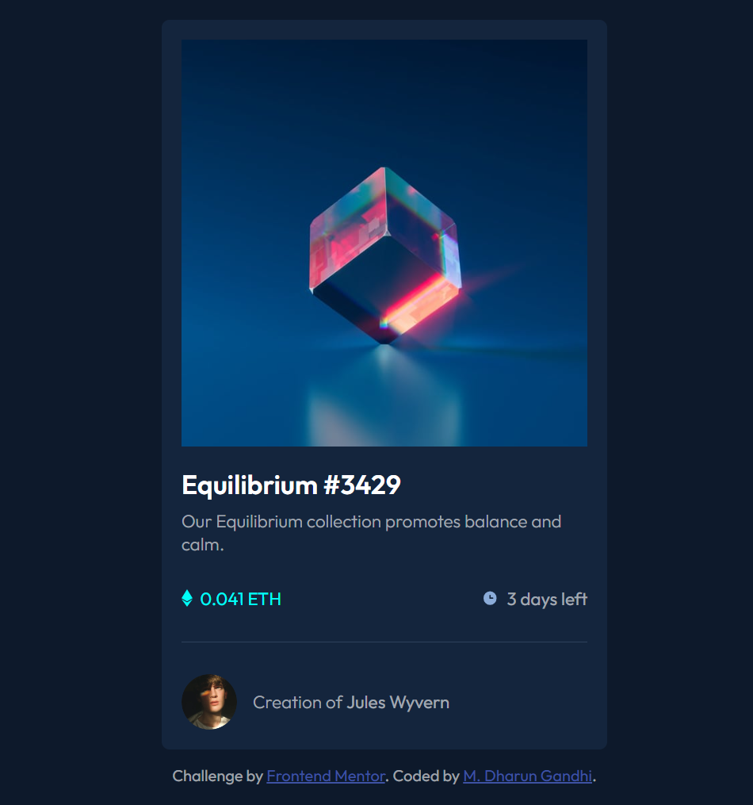
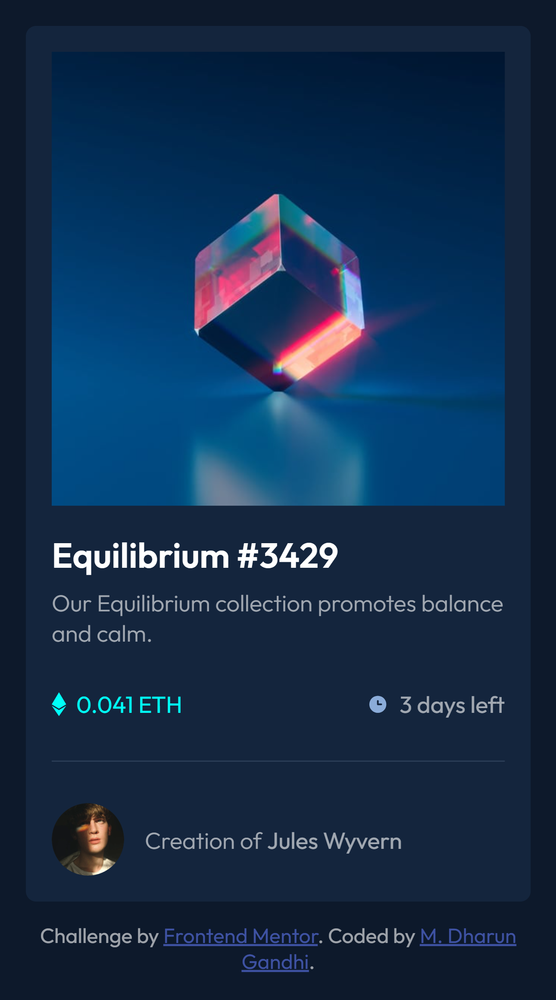

# Frontend Mentor - NFT-Preview-Card-Component

This is a solution to the [NFT-Preview-Card-Component challenge on Frontend Mentor](https://www.frontendmentor.io/challenges/nft-preview-card-component-SbdUL_w0U). Frontend Mentor challenges help you improve your coding skills by building realistic projects.

## Table of contents

- [Overview](#overview)
  - [The challenge](#the-challenge)
  - [Screenshot](#screenshot)
  - [Links](#links)
- [My process](#my-process)
  - [Built with](#built-with)
- [Author](#author)

## Overview

### Screenshot

### Links

- Solution URL: [Github Repo](https://github.com/Dharungandhy28/NFT-Preview-Card)
- Live Site URL: [Site URL](https://lucent-daifuku-a7df8a.netlify.app/)

## My process

### Built with

- Semantic HTML5 markup
- CSS custom properties
- Flexbox
- Mobile-first workflow

## Author

- Github - [Dharun Gandhi](https://github.com/Dharungandhy28)
- Frontend Mentor - [@Dharungandhy28](https://www.frontendmentor.io/profile/Dharungandhy28)
